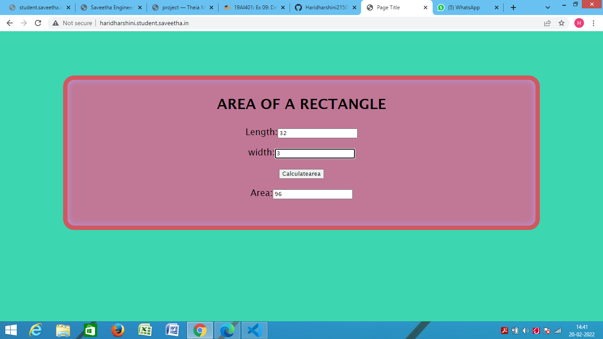

# Design a Website for Server Side Processing

## AIM:
To design a website to perform mathematical calculations in server side.

## DESIGN STEPS:

### Step 1:
Design a website for calculation using wireframe work.
### Step 2:
execute the wireframe work design use html and css.
### Step 3:
use views.py to execute the coding in serverside for response.
### Step 4:
In urls.py mention the path of the website.
### Step 5:
Publish the website in the given URL.

## PROGRAM :

### area.html:
```
<!DOCTYPE html>
<html>
<head>
    <meta charset='utf-8'>
    <meta http-equiv='X-UA-Compatible' content='IE=edge'>
    <title>Page Title</title>
    <meta name='viewport' content='width=device-width, initial-scale=1'>
    
</head>
<style>
    *{
        box-sizing: border-box;
        font-family:'Lucida Sans', 'Lucida Sans Regular', 'Lucida Grande', 'Lucida Sans Unicode', Geneva, Verdana, sans-serif
    }

    body{
    background-color: rgb(60, 214, 176);
    }

    .container{
    width: 1080px;
    height: 350px;
    margin-top: 100px;
    margin-left: auto;
    margin-right: auto;
    border-radius: 25px;
    border: 10px solid rgb(209, 88, 94);
    box-shadow: inset 0 0 15px rgb(181, 153, 231);
    background-color:rgb(192, 120, 150);
    }
    h1{
        text-align: center;
        padding-top: 15px;
    }
    .calculate{
        padding-top: 10px;
        padding-bottom: 10px;
        padding-left: 10px;
        padding-right:10px;
        text-align: center;
        font-size: 20px;
    }
</style>
<body>
    <div class="container">
        <h1>AREA OF A RECTANGLE</h1>
        <form method="POST">
            
            <div class="calculate"> 
                Length:<input type="text" name="length" value={{b}}></input><br/>
            </div>
            <div class="calculate">
                width:<input type="text" name="width" value={{h}}></input><br/>
            </div>
            <div class="calculate">
                <input type="submit" value="Calculatearea"></input><br/>
            </div>
            <div class="calculate">
                Area:<input type="text" name="area" value={{area}}></input>
            </div>
        </form>
    </div>
    
</body>
</html
```
### views.py:
```
from django.shortcuts import render

# Create your views here.
def areacalculation(request):
    context={}
    context[ 'area' ] = "0"  
    context[ 'l' ] = "0"
    context[ 'w' ] = "0"
    if request.method == 'POST':
        l = request.POST.get('length','0')
        w= request.POST.get('width','0')
        area = int(l) * int(w)
        context[ 'area' ] = area
        context[ 'l' ] = l
        context[ 'w' ] = w
 
    return render(request,'mathapp/area.html',context)
```
### urls.py:
```
from django.contrib import admin
from django.urls import path
from mathapp import views
urlpatterns = [
    path('admin/', admin.site.urls),
    path('areaofrectangle/',views.areacalculation,name="arearectangle"),
    path('',views.areacalculation,name="arearectangleroute")
]
```
## OUTPUT:

### Home Page:


## Result:
Thus the website is successfully designed for serverside processing.
